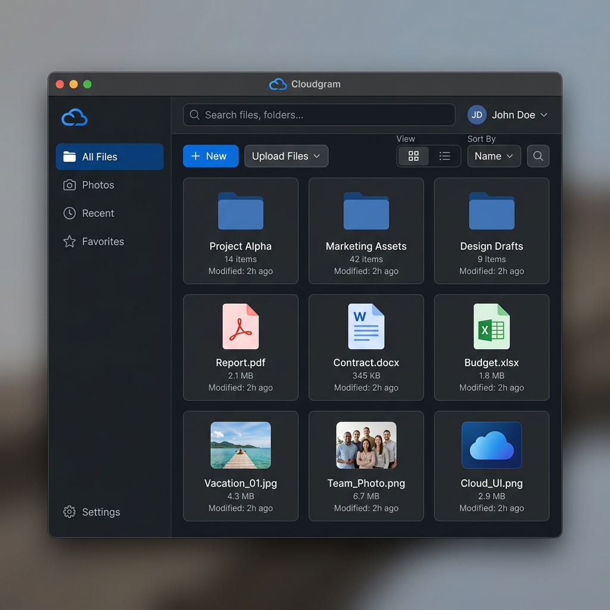

# ☁️ Cloudgram

**Cloudgram** is a high-performance, asynchronous desktop application that transforms your Telegram account into a powerful, unlimited cloud storage solution. Built with a modern aesthetic and deep integration, it provides a seamless file management experience directly on your Windows desktop.


*(Note: Replace `screenshot.png` in the root folder with an actual screenshot of the app)*

---

## 🚀 Key Features

*   **Unlimited Storage**: Leverage Telegram's infrastructure for virtually limitless cloud storage.
*   **Asynchronous Performance**: Built on `qasync` and `asyncio` for a lag-free, responsive UI even during heavy file transfers.
*   **Local Library Cache**: A local SQLite database tracks your files, allowing for instant search and browsing even when offline.
*   **Smart Syncing**: Automatically synchronizes your Telegram "Saved Messages" or specific channels to your local library.
*   **Modern Interface**: A clean, professional GUI built with PyQt6, featuring a "Fusion" dark mode aesthetic and intuitive navigation.
*   **Secure Authentication**: Direct integration with the official Telegram API using Telethon.

---

## 🛠️ Technology Stack

Cloudgram is powered by a robust stack of modern Python libraries:

| Category | Technology | Description |
| :--- | :--- | :--- |
| **Language** | [Python 3](https://www.python.org/) | The core programming language. |
| **GUI Framework** | [PyQt6](https://www.riverbankcomputing.com/software/pyqt/) | Industrial-strength cross-platform GUI framework. |
| **Async Bridge** | [qasync](https://github.com/Coyote-A/qasync) | Seamlessly integrates Python's `asyncio` with the Qt event loop. |
| **Telegram API** | [Telethon](https://docs.telethon.dev/) | Pure Python 3 MTProto client library for Telegram. |
| **Communication** | [Asyncio](https://docs.python.org/3/library/asyncio.html) | Handles all concurrent networking and background tasks. |
| **Database** | [SQLite](https://www.sqlite.org/) | High-speed local caching and file metadata management. |

---

## 📦 Installation

### Prerequisites
*   Python 3.10+
*   A Telegram [API ID and Hash](https://my.telegram.org/apps)

### Manual Setup
1.  **Clone the Repository**:
    ```bash
    git clone https://github.com/yourusername/Cloudgram.git
    cd Cloudgram
    ```

2.  **Create a Virtual Environment**:
    ```bash
    python -m venv .venv
    .\.venv\Scripts\activate
    ```

3.  **Install Dependencies**:
    ```bash
    pip install -r requirements.txt
    ```

4.  **Configure API**:
    Duplicate `telegram_api.example.json` to `telegram_api.json` and fill in your credentials.

---

## 🎮 Usage

### Launching the App
Simply run the bootstrap script to start Cloudgram with the optimized Windows launcher:
```bash
python main.py
```
Or use the provided `Run Cloudgram.bat` for one-click access.
Set `CLOUDGRAM_AUTOSYNC=0` before launch only if you want to skip the startup Telegram login and sync flow.

### First Run
Upon first launch, you will be prompted to log in to your Telegram account and Cloudgram will sync your Telegram library automatically. Cloudgram keeps `cloudgram_session.session`, `cloudgram.db`, and `cloudgram_launch.log` alongside the app in packaged builds, and alongside the repo in development.

---

## 📂 Project Structure

*   `main.py`: The application entry point and event loop orchestrator.
*   `ui/`: contains all PyQt6 window definitions and UI components.
*   `cloud_auth/`: Handles secure authentication flows for Telegram.
*   `core/`: Background synchronization and business logic.
*   `db/`: Local SQLite database schema and helper functions.
*   `cloudgram.db`: Your local file index.

---

## 🛡️ License
Distributed under the MIT License. See `LICENSE` for more information.

---
*Created with ❤️ for the Telegram community.*
